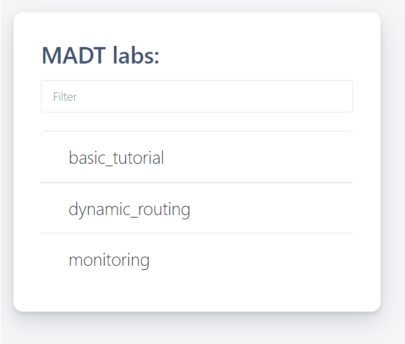
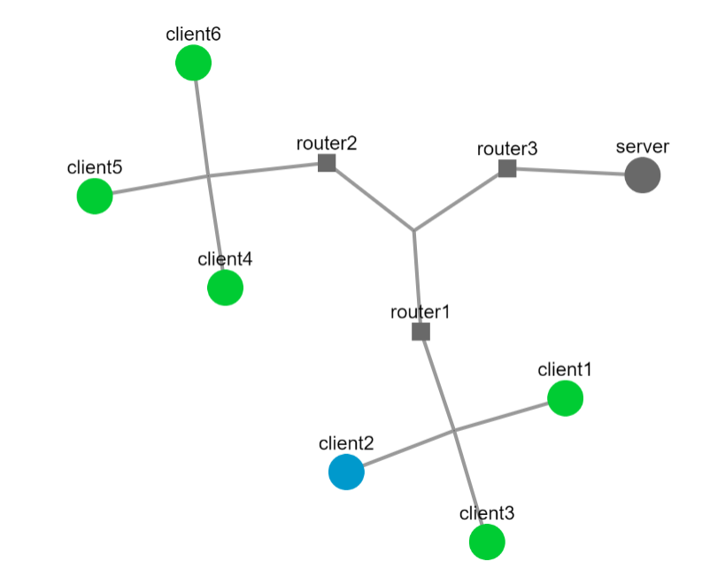

# Замена механизма запуска контейнеров с docker на footloose в madt

Санкт-Петербургский государственный университет

Факультет прикладной математики и процессов управления

Курс "Основы Grid и Cloud выислений"

## Demo

[Видео](https://youtu.be/FEGQw9gYz-0)

## MADT

The primary entity in MADT is a laboratory, a model of the simulated network. 
To start a model, MADT uses a minimal amount of information about virtual network structure and launch procedure of distributed application. 
This set of information also can be referred to as a model. MADT stores this information in the JSON-serialized file, lab.json. 

A graph represents the simulated network. Nodes of this graph can be a server, client, or router.
You can combine part of the network (a set of nodes) into a subnet and define rules for such subnet as well as configure the whole network. 


## How to define the model

We use madt_lib Python API to configure a model. It provides four classes for defining a network model:

* madt_lib.Node represents network nodes. There are two types of nodes: routers and computers (PC). Routers provide dynamic routing of packets on the network and PCs host components of the tested application.
* madt_lib.Subnet represents an IP subnetwork that connects a set of nodes.
* madt_lib.Overlay used to configure dynamic routing in the network. This is necessary for transferring data between computers from different subnets. 
* madt_lib.Network represents a wide or local area network. Each node, subnet or overlay of a network should be created only using its methods. A laboratory can have only one global network that can be used to create multiple local ones. 

Basic example with simple server-client interaction is defined in [tutorial/basic](https://github.com/erveve/madt/blob/fl/tutorials/basic/) folder.

## Footloose
В [madt_lib/runtimes/docker_runtime.py](https://github.com/erveve/madt/blob/fl/madt_lib/runtimes/docker_runtime.py) были заменены процессы запуска контейнеров и их уничтожения с docker на footloose. В функции ```start_lab``` на основе файла формата .json, описывающего модель, создается файл ```footloose.yaml```, где хранится конфигурация контейнеров, далее контейнеры запускаются с помощью ```footloose create``` в функции ```fl_create```, вызываемой из ```start_lab```. Удаляются машины в функции ```stop_lab``` через ```footloose delete```.

## Requirements:

   - Docker
   - [Footloose](https://github.com/weaveworks/footloose)
 
## How to run basic examples
- Download and launch MADT
```
   cd ~
   git clone --recursive https://github.com/erveve/madt/
   cd madt
   git checkout remotes/origin/fl
   mkdir ~/madt/labs && export MADT_LABS_DIR=$HOME/madt/labs
   mkdir ~/madt/sockets && export MADT_LABS_SOCKETS_DIR=$HOME/madt/sockets

   sudo pip3 install -r ./requirements.txt
   sudo make && sudo make install

   sudo -HE env PYTHONPATH=$HOME/madt:$PYTHONPATH SSH_PWD=demo python3 madt_ui/main.py 80  
```
- Build images and start labs
```
   #start basic tutorial
   cd ~/madt
   cd ./tutorials/basic
   python3 ./lab.py

   #build images for monitoring and dynamic routing
   cd ~/madt/tutorials/basic
   docker build -t madt/nginx .
   cd ../../images/quagga
   docker build -t madt/quagga .
   cd ../madt_client_fl
   docker build -t madt/client .
   cd ../../tutorials/monitoring_fl
   docker build -t madt/pyget .
   
   #start monitoring and dynamic routing
   python3 ./lab.py
   cd ../dynamic_routing
   python3 ./lab.py
```
- Open 127.0.0.1:80
- Login as ```demo:demo```
- Choose one model in a list of all available models



- Run model and see a list of all containers working within the model at the bottom


- Observe graph



- Control the various different limitations of the container’s network connections in container page


.
